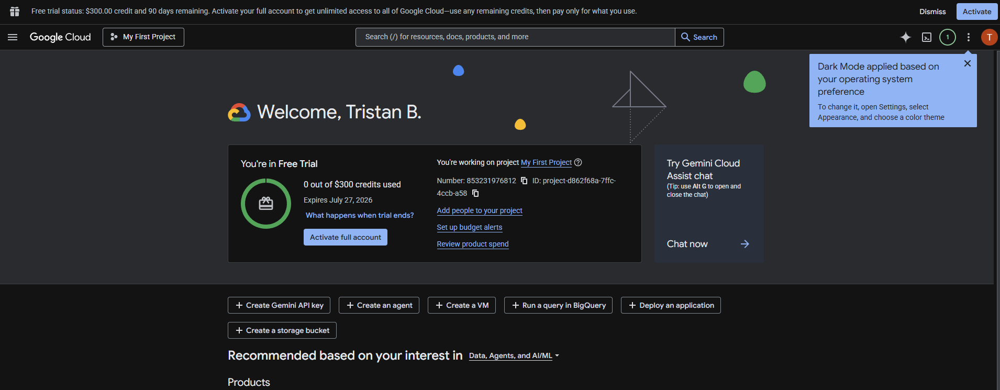

## Google Kubernetes Engine (GKE)
- One free Autopilot or zonal Standard cluster per month.
- The Free Tier credit applies to the cluster charge only. This credit doesn't apply to compute, networking, or other resources.

---

## reCAPTCHA
- 10,000 assessments per month.

---

## Secret Manager
- 6 active secret versions per month.
- 10,000 access operations per month.
- 3 secret rotation notifications per month.

